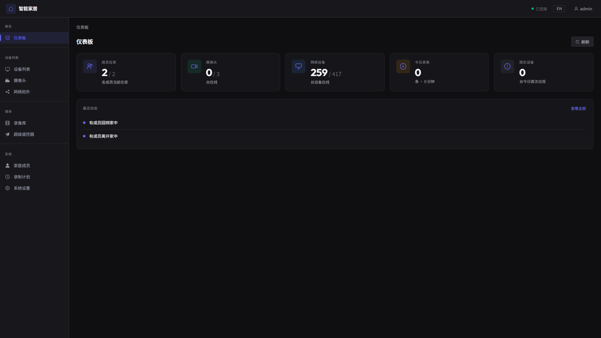
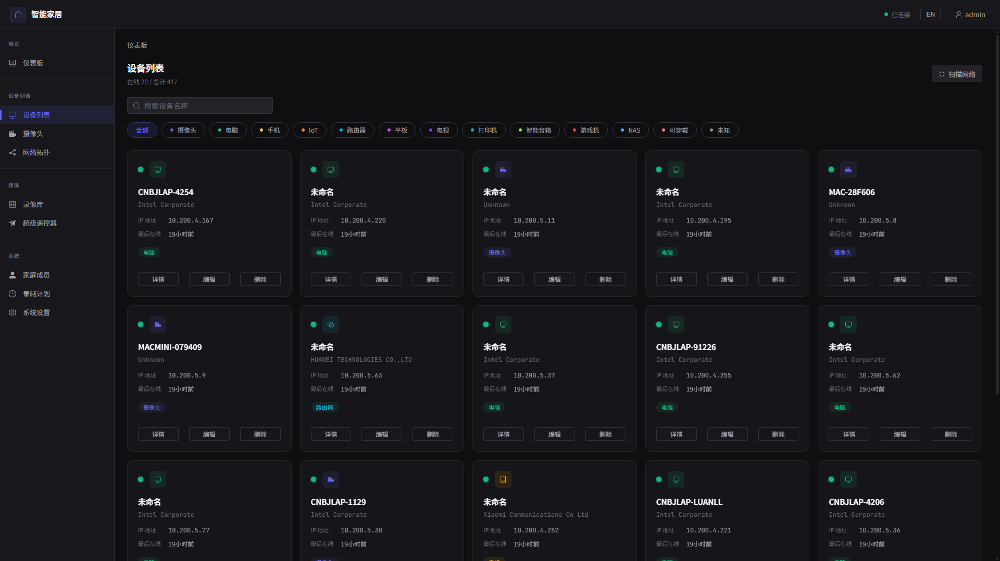
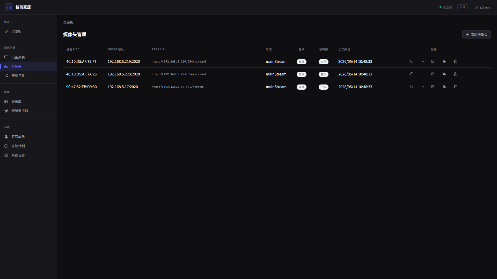
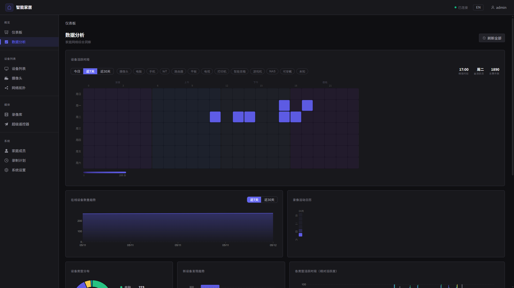
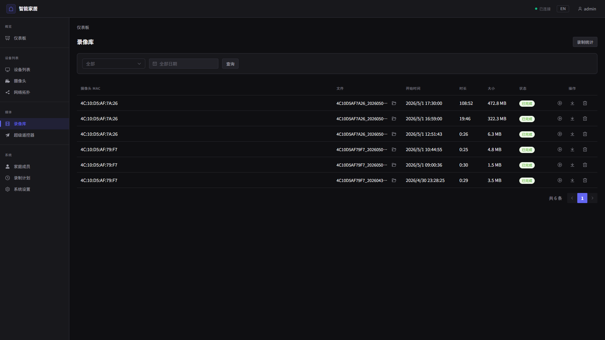
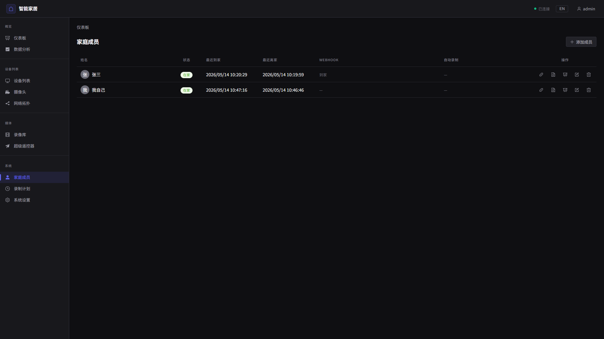
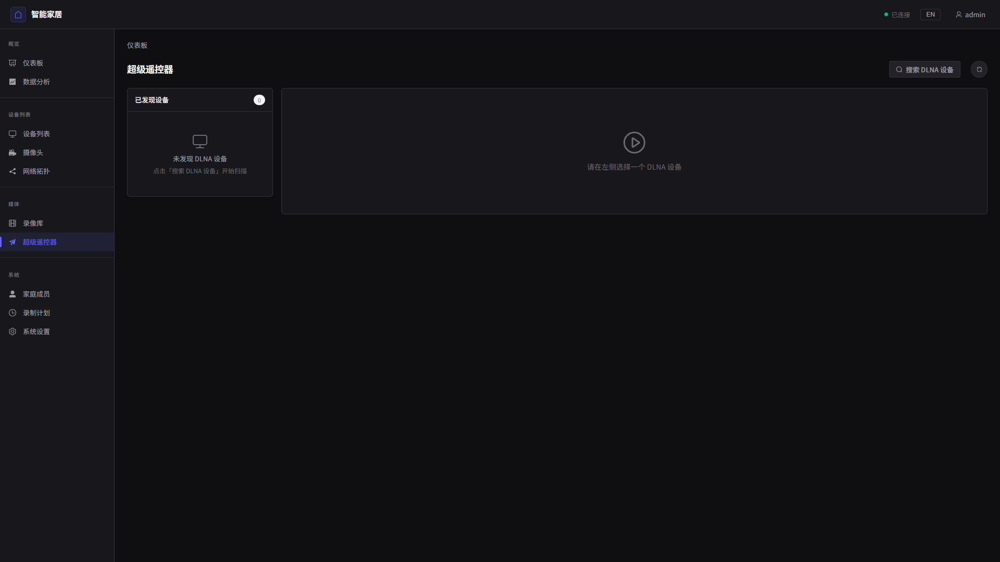
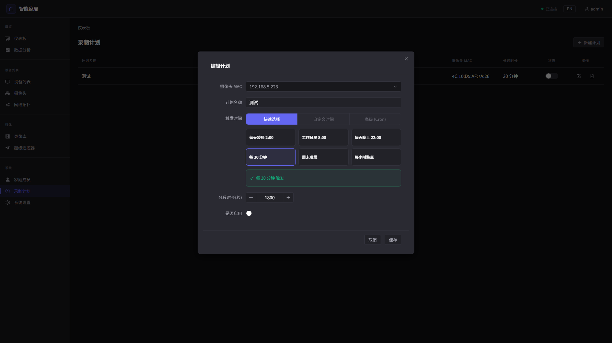
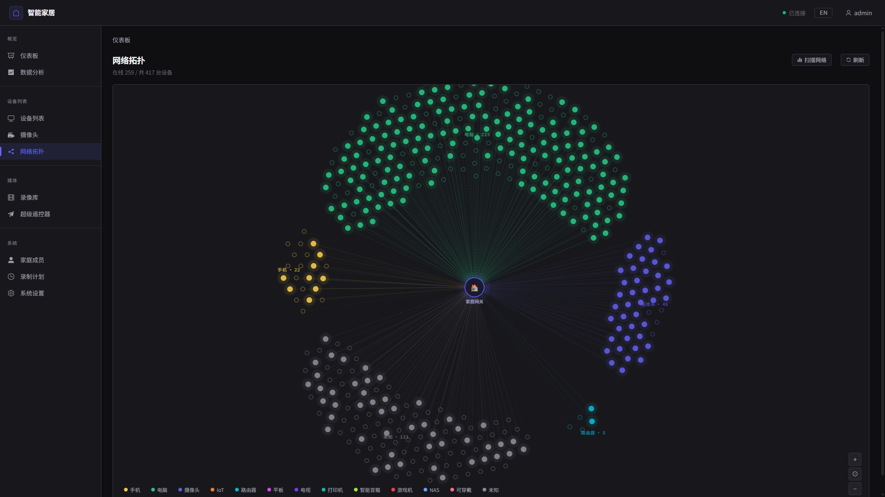
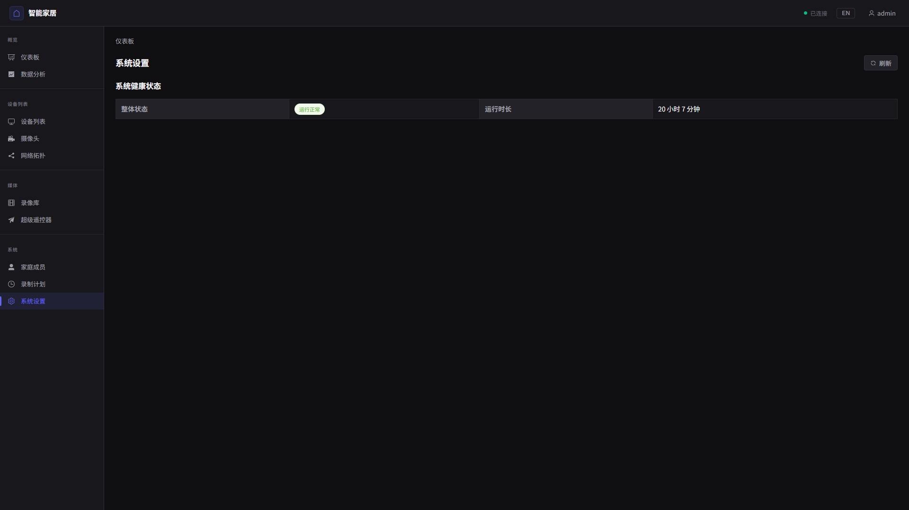

# 智能家居管理系统

基于 Vue 3 + Vite + Element Plus 构建的智能家居管理前端。支持网络设备监控、摄像头管理、数据分析等功能。

## 功能模块

### 控制台 (Dashboard)
系统总览，包括在家成员数、摄像头状态、网络设备、今日录像、新设备检测等。实时活动馈送展示最近发生的事件。



### 设备管理 (Devices)
浏览和管理所有网络设备。支持按设备类型筛选（摄像头、电脑、手机、IoT设备、路由器等），支持按 MAC/IP/主机名搜索，查看设备详情。



### 摄像头管理 (Cameras)
完整的摄像头管理功能，支持 ONVIF 协议。可实时预览（MJPEG/HLS）、抓图、开始/停止录像、探测摄像头能力。



### 数据分析 (Analytics)
全面的数据分析仪表盘，包含多种图表：
- **热力图**：设备按小时/天的活动分布
- **在线趋势**：设备在线/离线状态随时间变化
- **设备类型分布**：环形图展示各类设备占比
- **录像日历**：GitHub 风格的录像活动日历
- **响应时间**：设备延迟水平条形图
- **稳定性**：设备正常运行时间百分比
- **类型活动对比**：分组条形图对比各类型设备活动



### 录像回放 (Recordings)
浏览、播放、下载和删除录像。支持按摄像头和日期筛选，查看录像统计（总数、总时长、总大小）。



### 成员管理 (Members)
记录家庭成员的进出事件。



### DLNA / 投屏 (DLNA)
发现和管理 DLNA 投屏设备。



### 定时任务 (Schedule)
配置自动化任务和定时计划。



### 网络拓扑 (Topology)
可视化网络拓扑和设备连接关系。



### 系统设置 (Settings)
系统配置和偏好设置。



## 技术栈

- **Vue 3** 组合式 API（`<script setup>`）
- **Vite** 构建工具
- **Element Plus** UI 组件库
- **Pinia** 状态管理
- **Vue Router** 路由管理
- **Vue I18n** 国际化
- **D3.js** 数据可视化（图表）
- **Video.js** HLS 视频播放

## 快速开始

```bash
# 安装依赖
npm install

# 启动开发服务器
npm run dev

# 构建生产版本
npm run build
```

## 项目结构

```
src/
├── api/            # API 客户端模块
├── components/     # 可复用组件
│   ├── charts/     # D3.js 图表组件
│   └── ...
├── stores/         # Pinia 状态管理
├── views/          # 页面级组件
├── router/         # Vue Router 配置
├── composables/    # Vue 组合式函数
├── locales/        # 国际化翻译文件
└── assets/         # 静态资源
```
